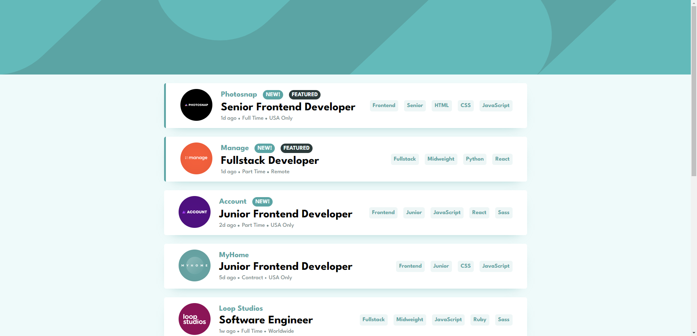

# Frontend Mentor - Job listings with filtering solution

This is a solution to the [Job listings with filtering challenge on Frontend Mentor](https://www.frontendmentor.io/challenges/job-listings-with-filtering-ivstIPCt). Frontend Mentor challenges help you improve your coding skills by building realistic projects. 

## Table of contents

- [Overview](#overview)
  - [The challenge](#the-challenge)
  - [Screenshot](#screenshot)
  - [Links](#links)
- [My process](#my-process)
  - [Built with](#built-with)
  - [What I learned](#what-i-learned)
  - [Continued development](#continued-development)
- [Author](#author)

## Overview

### The challenge

Users should be able to:

- View the optimal layout for the site depending on their device's screen size
- See hover states for all interactive elements on the page
- Filter job listings based on the categories

### Screenshot



### Links

- Solution URL: [https://www.frontendmentor.io/solutions/job-listings-app-built-with-html-scss-reactjs-and-typescript-0OwfQ0CEz_](https://www.frontendmentor.io/solutions/job-listings-app-built-with-html-scss-reactjs-and-typescript-0OwfQ0CEz_)
- Live Site URL: [https://liquidwater0.github.io/job-listing-app/](https://liquidwater0.github.io/job-listing-app/)

## My process

### Built with

- Semantic HTML5 markup
- CSS custom properties
- Flexbox
- [React](https://reactjs.org/) - JS library
- [Sass](https://sass-lang.com/) - CSS preprocessor

### What I learned

Learned a little about how file paths work with vite.

```js
function getLogoPath() {
    if (import.meta.env.PROD) return `${import.meta.env.BASE_URL}assets/${logo}`;
    if (import.meta.env.DEV) return `../../../src/assets/${logo}`;
}
```

### Continued development

In the future I want to try and improve on my CSS and JavaScript skills, as well as improving how I do my file structure.

## Author

- Frontend Mentor - [@liquidwater0](https://www.frontendmentor.io/profile/liquidwater0)